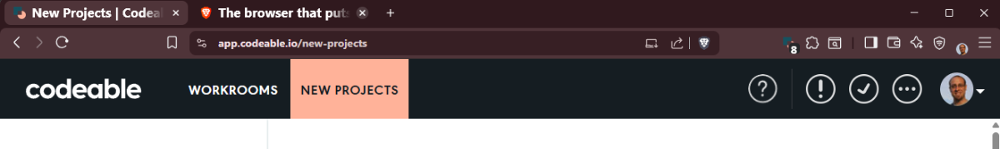
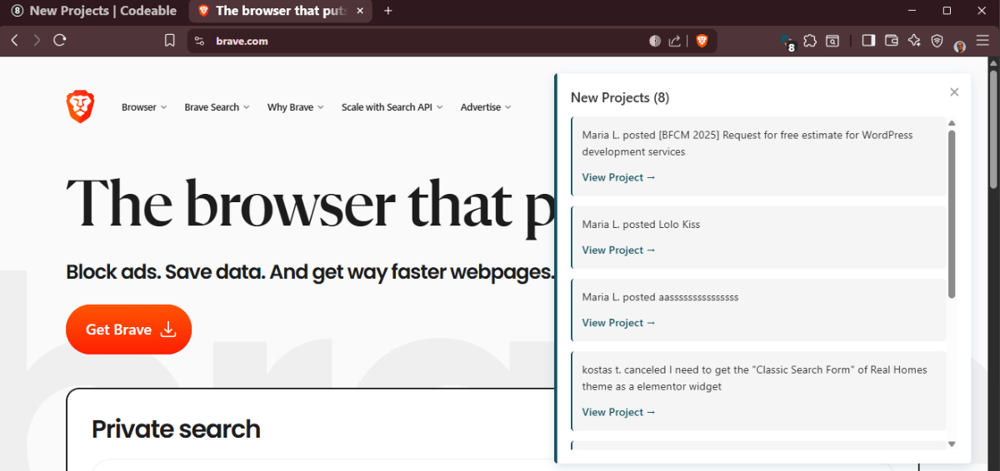

<!-- @format -->

# Codeable Notifications

Chrome extension for monitoring Codeable.io notifications.

## Screenshots

_Badge on extension icon_

_Notification message with link on other tabs_

## Installation

1. Open `chrome://extensions/` or `brave://extensions/`
2. Enable **Developer mode**
3. Click **Load unpacked**
4. Select this folder

## Features

- **Badge**: Notification count on extension icon (all tabs)
- **Favicon**: Green circle with count on Codeable tab (when in background)
- **Popup**: Notification message with link on other tabs
- **Auto-check**: Every 60 seconds when tab is in background

## Usage

- Badge and favicon update automatically
- Click extension icon on Codeable tab to clear all notifications
- Notification popup stays visible until manually closed

## Files

- `manifest.json` - Extension configuration
- `background.js` - Service worker (badge management)
- `codeable-monitor.js` - Content script for Codeable.io
- `notification-display.js` - Content script for other tabs
- `notification-display.css` - Notification popup styles
